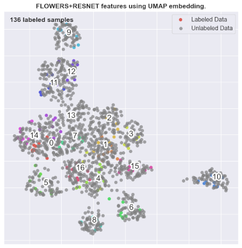
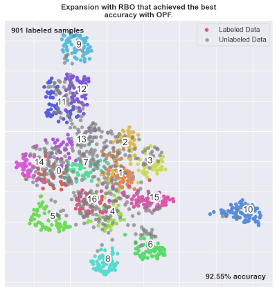
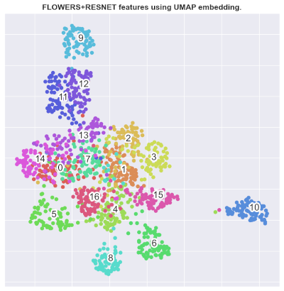

# Weakly Supervised Experiments Framework (WSEF)

Dept. of Statistic, Applied Math. and Computing, Universidade Estadual Paulista ([UNESP](http://www.rc.unesp.br/)), Rio Claro, Brazil

----------------------
* [Overview](#overview)
* [Requirements](#requirements)
* [Installation](#installation)
* [Execution](#execution)
* [Results](#results)
* [Visualization](#visualization)
* [Contributing](#contributing)
* [Cite](#cite)
* [Contact](#contact)
* [Acknowledgments](#acknowledgments)
* [License](#license)

## Overview
This framework implements the approach proposed in the paper [''Weakly Supervised Learning through Rank-based Contextual Measures''](https://doi.org/10.1109/ICPR48806.2021.9412596).
It proposes a rank-based model to exploit contextual information encoded in the unlabeled data in order to perform label expansion and execute a weakly supervised classification.

Available Classifiers:
- [Traditional kNN](https://scikit-learn.org/stable/modules/neighbors.html)
- [Support Vector Machines (SVM)](https://scikit-learn.org/stable/modules/svm.html)
- [Optimum-path Forest (OPF)](https://github.com/marcoscleison/PyOPF)
- [Graph Convolutional Network (GCN)](https://arxiv.org/pdf/1609.02907.pdf)

Available Correlation Measures:
- Intersection
- Spearman
- RBO
- Jaccard
- Jaccard K
- Kendall Tau
- Kendall Tau W

## Requirements
This software runs in any computer and OS that supports Python 3.7.
A Nvidia GPU is recommended for experiments with Graph Convolutional Networks (GCN), but it is not essential.

## Installation

Python 3.7 is recommended for the WSEF.
We recommend the user to create a virtual environment.

#### GNU/Linux

If you are using a GNU/Linux OS, all the requirements can be installed using the <em>install_dependencies.sh</em> script.
You can follow the commands:
```
chmod +x install_dependencies.sh
./install_dependencies.sh
```
By default, the CPU version of [torch-geometric](https://github.com/rusty1s/pytorch_geometric) is installed.
If you wish, you can change it to GPU by changing the word <em>cpu</em> in lines 15 and 16 to your corresponding NVIDIA CUDA version (<em>cu101</em>, <em>cu102</em>, <em>cu111</em>).

#### Other Operating Systems

You can install the main requirements using the command:
```
pip install -r requirements.txt
```

[Torch-geometric](https://github.com/rusty1s/pytorch_geometric) is also required as a dependence for running the GCN classifier.
Both torch-geometric 1.8 and 1.9 are compatible. 
You can install it following the instructions in the [official torch-geometric repository](https://github.com/rusty1s/pytorch_geometric) or executing the following commands (CPU version):
```
pip install torch-scatter -f https://pytorch-geometric.com/whl/torch-1.9.0+cpu.html
pip install torch-sparse -f https://pytorch-geometric.com/whl/torch-1.9.0+cpu.html
pip install torch-geometric
```

Finally, install [PyOPF](https://github.com/marcoscleison/PyOPF) following the instructions in the [official repository](https://github.com/marcoscleison/PyOPF).

## Configuration

WSEF is capable of executing multiple experiments in different [datasets](datasets).
The <em>config.py</em> file specifies the execution parameters.
In the beginning of the file, the <em>datasets</em> list defines the datasets that are going to be used.
A dictionary is defined to specify the parameters of each dataset.
The users can change the parameters according to their needs.

Some notes:
- The <em>thresholds</em> were defined according to the experiments presented in the [paper](https://doi.org/10.1109/ICPR48806.2021.9412596).
- For more information about the available datasets, consult [this page](datasets).

```python
# list of datasets to run execution
datasets = ["flowers"]

# init dictionary of parameters
dataset_settings = dict()

# flowers dataset parameters
dataset_settings["flowers"] = { "descriptors": ["resnet"],
                                "classifiers": ["opf", "svm", "knn", "gcn"],
                                "correlation_measures": ["intersection", "jaccard", "jaccard_k", "kendalltau", "rbo", "spearman"],
                                "thresholds": {"intersection": 0.15,
                                               "jaccard": 0.45,
                                               "jaccard_k": 0.30,
                                               "kendalltau": 0.55,
                                               "rbo": 0.20,
                                               "spearman": 0.55},
                                "top_k": 80,
                                "dataset_size": 1360,
                                "L": 400,
                                "n_executions": 1,
                                "n_folds": 10,
}
```

## Execution

After the [configuration](#configuration) is done, the execution can be performed by running:

```
python wsef.py
```

## Results

All the generated results are stored in the <em>results</em> directory.
The text files contain a report of the executions for each dataset and classifier.
For example:

```
Classifier: opf
Dataset: flowers
Folds: 10
n_executions: 5
	**********
	Descriptor: resnet
	**********
	Running 5 times without training set expansion...
		Mean acc = 71.77%
	****
	Correlation Measure: rbo / top_k: 80 / th: 0.2
	Running 5 times with training set expansion...
		Threshold = 0.2
		Mean acc = 81.08%
		Relative Gain = 12.97%
		Absolute Gain = 9.31%
	****
	Correlation Measure: jaccard / top_k: 80 / th: 0.45
	Running 5 times with training set expansion...
		Threshold = 0.45
		Mean acc = 75.64%
		Relative Gain = 5.38%
		Absolute Gain = 3.86%
**********
```

## Visualization

Plots are generated in the <em>results/plots</em> directory.
The plots show the distribution of elements after the UMAP method is applied to the features.
The colored dots are the ones where the labels are known.
Elements of the same class are labeled with the same color.
Some examples are shown for the Oxford17Flowers dataset.

- Distribution of labeled and unlabeled data before label expansion.



- Distribution of labeled and unlabeled data after the label expansion of our approach.



- Real dataset labels.




## Contributing
We appreciate suggestions, ideas and contributions.
If you want to contribute, feel free to [contact us.](#contact)
Github pull requests should be avoided because they are not part of our review process.
To report small bugs, you can use the [issue tracker](https://github.com/UDLF/WSEF/issues) provided by GitHub.

## Cite
If you use this software, please cite

```latex
@inproceedings{paperWSEF,
    author={Presotto, João Gabriel Camacho and Valem, Lucas Pascotti and de Sá, Nikolas Gomes and Pedronette, Daniel Carlos Guimarães and Papa, João Paulo},
    booktitle={2020 25th International Conference on Pattern Recognition (ICPR)},
    title={Weakly Supervised Learning through Rank-based Contextual Measures},
    year={2021},
    volume={},
    number={},
    pages={5752-5759},
    doi={10.1109/ICPR48806.2021.9412596},
}
```

## Contact
**Lucas Pascotti Valem**: `lucaspascottivalem@gmail.com` or `lucas.valem@unesp.br`

**João Gabriel Camacho Presotto**: `joaopresotto@gmail.com`

**Daniel Carlos Guimarães Pedronette**: `daniel.pedronette@unesp.br`

## Acknowledgments
The authors are grateful to São Paulo Research Foundation - [FAPESP](http://www.fapesp.br/en/) (grants 2020/11366-0, 2019/04754-6, and 2017/25908-6).

## License
This project is licensed under GPLv2. See [details.](LICENSE)
